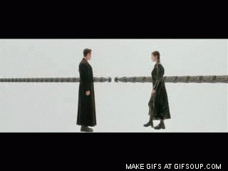

# Contents

- [lad_compare.py](#lad_compare.py)
- [postcode_search.py](#postcode_search.py)

## lad_compare.py

### Why?
Every quarter Openreach release a new version of a CSV file called the "LAD" file. This file maps each UK postcode to the exchange that *would* be used if an EAD fibre circuit were to be ordered to a given UK postcode (it's called the "fibre serving exchange").

Openreach don't tell you which postcodes have been added or removed or how many. The LAD file has circa 1.8M rows which is too large to open in applications like Microsoft Excel. This script will compare the two LAD files (CSV files) and produce two new files which have a list of postcode entries that are unique to each input file.

In this example we'll compare the 2019 Q2 LAD file with the 2019 Q2 LAD file.


### Problem Scoping 1
The first problem is that file 1 has 1,867,414 rows and file 2 has 1,867,749 rows. File 2 is 335 rows larger but there might be more than 335 new postcode entries, for example some rows may no longer be present in file 2 which were in file 1. This means that in the worst case scenario every row in file 1 needs to be checked against every row in file 2, in a simple `for` loop to check if each postcode exists in both files (and this, which postcodes are unique to each file). A naïve suggestion then would be that the **N**umber **o**f **C**hecks required is `1,867,414 * 1,867,749 == 3,487,860,631,086` checks.


### Problem Scoping 2
A basic conjecture we can make is that when searching for a postcode in file 1 in file 2, 50% of time if a matching postcode exists in file 2 it will be found in the first 50% of file 2 (this should be independent of file order). This means the NoC is already cut in half and reduced to `1,867,414 * (1,867,749/2) == 1,743,930,315,543` checks.


### Problem Scoping 3
A simple change can be made to the basic for loop idea which reduces the NoC significantly. As each row in file 1 is looped over, and compared against every row in file 2, once a match is found in file 2, the matching row in file 2 can be deleted so that each subsequent row in file 1 has a reducing file 2 to search through. Now, “only” the nth triangle of 1,867,414 rows needs to be checked, and as above statistically 50% of file 1 rows will be in the first 50% of file 2, the entire of file 2 doesn't need to be walked for each file 1 row. NoC is now `1,867,749 * (1,867,414/2) == 1,743,930,315,543 / 2 == ~871,965,157,771.5` checks.


### Problem Scoping 4
There is an exception to the previously mentioned 50% conjecture; If the two files were explicitly sorted in reverse order to each other, i.e. file 1 is explicitly sorted by postcode in alphabetical order from A to Z and file 2 is explicitly sorted from Z to A, then for each row in file 1 we'll need to always search to the end (or near the end) of file 2 to find the matching row (if one exists). 

This means that the first action which must be made is that both files must be sorted. Sorting takes <1 second and as a result for each row in file 1 the matching row is going to be the first row in 2 (or very near the start) because each matched row is deleted from file 2. The NoC now  becomes more or less "the number of rows in the smaller of the two files", `NoC == 1,867,414`. In a theoretical worst case scenario that all the postcodes in file 1 aren't present in file 2, no entries from file 2 would be delete because none would match any entry in file 1, and we'd be back to square 1 with NoC returning to `1,867,414 * 1,867,749 == 3,487,860,631,086` checks. 

In reality there would be no point comparing the two CSV files if we knew they were completely different, but we know this is an updated version of the same file and they'll be 99% overlapping. This means that the NoC should be on the same scale of order as `1,867,414`. This is because we expect some new postcode entries and for those few entries we'll walk the entire list to find no match confirming it's a new entry.


### Multi-Threading
To cater for the worst case scenarios the simple solution is "guns, lots of guns"



It's less costly to sanitise data up-front rather than during the comparison loop so that any data cleansing actions aren't repeated on any entries parsed more than once. The script sorts both lists alphabetically and normalises the data (it converts all postcodes to the same case and strips whitespace, we can't rely on Openreach to provide consistently formatted data!).

The script then divides both files into the same number of chunks as there are CPU threads on the system, and spins up multiple threads and gives each thread two chunks (one chunk from each file) to compare.


### Results
Below are the results from running the script. After modifying the script to return the number of checks each thread made instead of the unique postcodes, across all thread in total 28,688,266 checks were made and the unmodified version of the script shown below shows that these 28,688,266 checks were made in ~46 seconds which is ~623,658 checks per second.

Note: the newer file is specified first!
```
$python3 ./lad_compare.py -f1 ../LODE_LAD-2019-Q3.csv -f2 ../LODE_LAD-2019-Q2.csv
Loading csv...
Loaded 1867749 CSV rows from ../LODE_LAD-2019-Q3.csv
Loaded in 9.157270179000001 seconds
Loading csv...
Loaded 1867414 CSV rows from ../LODE_LAD-2019-Q2.csv
Loaded in 9.415181116 seconds
Formatting postcodes...
Formatted in 1.6520208340000018 seconds
Sorting postcodes...
Sorted in 0.5936550419999982 seconds
Number of CPUs:  12
Chunk size per CPU: 155646
Chunking and merging LAD and Fibre data...
Chunked data in 0.4653325989999999 seconds
Chunk 0: file 1 entries 155646, file 2 entries 155622
Chunk 1: file 1 entries 155646, file 2 entries 155605
Chunk 2: file 1 entries 155646, file 2 entries 155618
Chunk 3: file 1 entries 155646, file 2 entries 155614
Chunk 4: file 1 entries 155646, file 2 entries 155623
Chunk 5: file 1 entries 155646, file 2 entries 155612
Chunk 6: file 1 entries 155646, file 2 entries 155613
Chunk 7: file 1 entries 155646, file 2 entries 155615
Chunk 8: file 1 entries 155646, file 2 entries 155618
Chunk 9: file 1 entries 155646, file 2 entries 155621
Chunk 10: file 1 entries 155646, file 2 entries 155619
Chunk 11: file 1 entries 155643, file 2 entries 155622
Total number of entries in all file 1 chunks: 1867749
Total number of entries in all file 2 chunks: 1867402
Worst case scenario checks to be made: 3487838218098
Starting the comparison....
Started process: <ForkProcess(ForkPoolWorker-1, started daemon)> (23343)
Started process: <ForkProcess(ForkPoolWorker-2, started daemon)> (23344)
Started process: <ForkProcess(ForkPoolWorker-3, started daemon)> (23345)
Started process: <ForkProcess(ForkPoolWorker-4, started daemon)> (23346)
Started process: <ForkProcess(ForkPoolWorker-5, started daemon)> (23347)
Started process: <ForkProcess(ForkPoolWorker-6, started daemon)> (23348)
Finished process: <ForkProcess(ForkPoolWorker-1, started daemon)> (23343)
Started process: <ForkProcess(ForkPoolWorker-7, started daemon)> (23349)
Finished process: <ForkProcess(ForkPoolWorker-2, started daemon)> (23344)
Started process: <ForkProcess(ForkPoolWorker-8, started daemon)> (23350)
Finished process: <ForkProcess(ForkPoolWorker-3, started daemon)> (23345)
Started process: <ForkProcess(ForkPoolWorker-9, started daemon)> (23351)
Started process: <ForkProcess(ForkPoolWorker-10, started daemon)> (23352)
Finished process: <ForkProcess(ForkPoolWorker-4, started daemon)> (23346)
Started process: <ForkProcess(ForkPoolWorker-11, started daemon)> (23353)
Finished process: <ForkProcess(ForkPoolWorker-5, started daemon)> (23347)
Started process: <ForkProcess(ForkPoolWorker-12, started daemon)> (23354)
Finished process: <ForkProcess(ForkPoolWorker-6, started daemon)> (23348)
Finished process: <ForkProcess(ForkPoolWorker-7, started daemon)> (23349)
Finished process: <ForkProcess(ForkPoolWorker-8, started daemon)> (23350)
Finished process: <ForkProcess(ForkPoolWorker-9, started daemon)> (23351)
Finished process: <ForkProcess(ForkPoolWorker-10, started daemon)> (23352)
Finished process: <ForkProcess(ForkPoolWorker-11, started daemon)> (23353)
Finished process: <ForkProcess(ForkPoolWorker-12, started daemon)> (23354)
Finished comparison in 46.077212692 seconds
Entries in file ../LODE_LAD-2019-Q3.csv not in file ../LODE_LAD-2019-Q2.csv: 347
Entries in file ../LODE_LAD-2019-Q2.csv not in file ../LODE_LAD-2019-Q3.csv: 0
```

## postcode_search.py

### Why?
The CSV (LAD) files from Openreach are so big that applications like Microsoft Excel can't open them :(

### Results
Search for an exact postcode in the Openreach LAD file or search for similar postcodes.

```
$python3 ./postcode_search.py -l ../LODE_LAD-2019-Q3.csv -p E16PU
Loaded 1867749 postcodes from LAD file
+---------------+----------+--------+----------+---------------------+---------------------+-----------------+
| exchange_1141 | postcode | mdf_id | site_id  | fibre_upto_exchange | fibre_upto_postcode |  exchange_name  |
+---------------+----------+--------+----------+---------------------+---------------------+-----------------+
|     L/BIS     |  E1 6PU  | CLBIS  | EZ0025A1 |          Y          |          Y          | BISHOPSGATE T E |
+---------------+----------+--------+----------+---------------------+---------------------+-----------------+

$python3 ./postcode_search.py -l ../LODE_LAD-2019-Q3.csv -p E16P -n
Loaded 1867749 postcodes from LAD file
+---------------+----------+---------+----------+---------------------+---------------------+------------------------+
| exchange_1141 | postcode |  mdf_id | site_id  | fibre_upto_exchange | fibre_upto_postcode |     exchange_name      |
+---------------+----------+---------+----------+---------------------+---------------------+------------------------+
|     L/BIS     |  E1 6PA  |  CLBIS  | EZ0025A1 |          Y          |          N          |    BISHOPSGATE T E     |
|     L/BIS     |  E1 6PD  |  CLBIS  | EZ0025A1 |          Y          |          Y          |    BISHOPSGATE T E     |
|     L/BIS     |  E1 6PE  |  CLBIS  | EZ0025A1 |          Y          |          N          |    BISHOPSGATE T E     |
|     L/BIS     |  E1 6PG  |  CLBIS  | EZ0025A1 |          Y          |          Y          |    BISHOPSGATE T E     |
|     L/BIS     |  E1 6PJ  |  CLBIS  | EZ0025A1 |          Y          |          Y          |    BISHOPSGATE T E     |
|     L/BIS     |  E1 6PL  |  CLBIS  | EZ0025A1 |          Y          |          N          |    BISHOPSGATE T E     |
|     L/BIS     |  E1 6PN  |  CLBIS  | EZ0025A1 |          Y          |          N          |    BISHOPSGATE T E     |
|     L/BIS     |  E1 6PP  |  CLBIS  | EZ0025A1 |          Y          |          N          |    BISHOPSGATE T E     |
|     L/SHO     |  E1 6PQ  |  CLSHO  | EZ0028A1 |          Y          |          Y          |     SHOREDITCH T E     |
|     L/BIS     |  E1 6PR  |  CLBIS  | EZ0025A1 |          Y          |          N          |    BISHOPSGATE T E     |
|     L/BIS     |  E1 6PS  |  CLBIS  | EZ0025A1 |          Y          |          N          |    BISHOPSGATE T E     |
|     L/BIS     |  E1 6PU  |  CLBIS  | EZ0025A1 |          Y          |          Y          |    BISHOPSGATE T E     |
|     L/BIS     |  E1 6PX  |  CLBIS  | EZ0025A1 |          Y          |          Y          |    BISHOPSGATE T E     |
|     L/BIS     |  E1 6PZ  |  CLBIS  | EZ0025A1 |          Y          |          N          |    BISHOPSGATE T E     |
|      MTF      | LE1 6PA  | EMMONTF | LE0079A1 |          Y          |          N          | LEICESTER MONTFORT ATE |
|      MTF      | LE1 6PB  | EMMONTF | LE0079A1 |          Y          |          N          | LEICESTER MONTFORT ATE |
|      MTF      | LE1 6PD  | EMMONTF | LE0079A1 |          Y          |          N          | LEICESTER MONTFORT ATE |
|      MTF      | LE1 6PL  | EMMONTF | LE0079A1 |          Y          |          N          | LEICESTER MONTFORT ATE |
|      MTF      | LE1 6PN  | EMMONTF | LE0079A1 |          Y          |          N          | LEICESTER MONTFORT ATE |
|      MTF      | LE1 6PP  | EMMONTF | LE0079A1 |          Y          |          N          | LEICESTER MONTFORT ATE |
|      MTF      | LE1 6PS  | EMMONTF | LE0079A1 |          Y          |          N          | LEICESTER MONTFORT ATE |
|      MTF      | LE1 6PT  | EMMONTF | LE0079A1 |          Y          |          N          | LEICESTER MONTFORT ATE |
|      MTF      | LE1 6PW  | EMMONTF | LE0079A1 |          Y          |          N          | LEICESTER MONTFORT ATE |
|      NT/B     | NE1 6PA  |   NENT  | NE0051A1 |          Y          |          Y          |    NEWCASTLE C T E     |
|      NT/B     | NE1 6PB  |   NENT  | NE0051A1 |          Y          |          Y          |    NEWCASTLE C T E     |
|      NT/B     | NE1 6PD  |   NENT  | NE0051A1 |          Y          |          Y          |    NEWCASTLE C T E     |
|      NT/B     | NE1 6PE  |   NENT  | NE0051A1 |          Y          |          N          |    NEWCASTLE C T E     |
|      NT/B     | NE1 6PF  |   NENT  | NE0051A1 |          Y          |          Y          |    NEWCASTLE C T E     |
|      NT/B     | NE1 6PN  |   NENT  | NE0051A1 |          Y          |          Y          |    NEWCASTLE C T E     |
|      NT/B     | NE1 6PT  |   NENT  | NE0051A1 |          Y          |          N          |    NEWCASTLE C T E     |
|      NT/B     | NE1 6PX  |   NENT  | NE0051A1 |          Y          |          N          |    NEWCASTLE C T E     |
|      NT/B     | NE1 6PY  |   NENT  | NE0051A1 |          Y          |          N          |    NEWCASTLE C T E     |
|      NT/B     | NE1 6PZ  |   NENT  | NE0051A1 |          Y          |          N          |    NEWCASTLE C T E     |
|     L/BER     | SE1 6PA  |  CLBER  | SE0004A1 |          Y          |          N          |     BERMONDSEY T E     |
|     L/WAT     | SE1 6PB  | WRSTHBK | SE0049A1 |          Y          |          N          |     COLOMBO HOUSE      |
|     L/WAT     | SE1 6PD  | WRSTHBK | SE0049A1 |          Y          |          N          |     COLOMBO HOUSE      |
|     L/WAT     | SE1 6PE  | WRSTHBK | SE0049A1 |          Y          |          N          |     COLOMBO HOUSE      |
|     L/WAT     | SE1 6PF  | WRSTHBK | SE0049A1 |          Y          |          N          |     COLOMBO HOUSE      |
|     L/WAT     | SE1 6PG  | WRSTHBK | SE0049A1 |          Y          |          N          |     COLOMBO HOUSE      |
|     L/WAT     | SE1 6PH  | WRSTHBK | SE0049A1 |          Y          |          N          |     COLOMBO HOUSE      |
|     L/WAT     | SE1 6PJ  | WRSTHBK | SE0049A1 |          Y          |          N          |     COLOMBO HOUSE      |
|     L/WAT     | SE1 6PL  | WRSTHBK | SE0049A1 |          Y          |          N          |     COLOMBO HOUSE      |
|     L/WAT     | SE1 6PN  | WRSTHBK | SE0049A1 |          Y          |          N          |     COLOMBO HOUSE      |
|     L/WAT     | SE1 6PP  | WRSTHBK | SE0049A1 |          Y          |          N          |     COLOMBO HOUSE      |
|     L/WAT     | SE1 6PQ  | WRSTHBK | SE0049A1 |          Y          |          N          |     COLOMBO HOUSE      |
|     L/WAT     | SE1 6PR  | WRSTHBK | SE0049A1 |          Y          |          N          |     COLOMBO HOUSE      |
|     L/WAT     | SE1 6PS  | WRSTHBK | SE0049A1 |          Y          |          N          |     COLOMBO HOUSE      |
|     L/WAT     | SE1 6PT  | WRSTHBK | SE0049A1 |          Y          |          N          |     COLOMBO HOUSE      |
|     L/WAT     | SE1 6PU  | WRSTHBK | SE0049A1 |          Y          |          N          |     COLOMBO HOUSE      |
|     L/WAT     | SE1 6PW  | WRSTHBK | SE0049A1 |          Y          |          N          |     COLOMBO HOUSE      |
|     L/WAT     | SE1 6PX  | WRSTHBK | SE0049A1 |          Y          |          N          |     COLOMBO HOUSE      |
+---------------+----------+---------+----------+---------------------+---------------------+------------------------+
```
